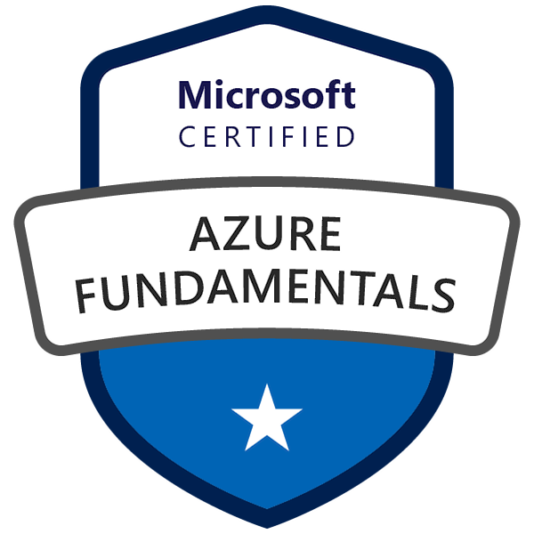
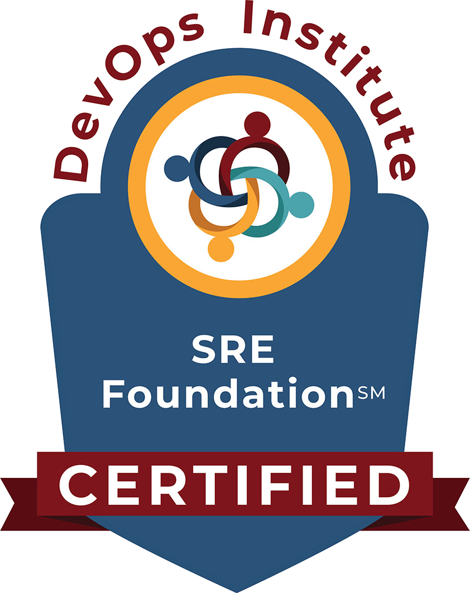

# About Me

I'm a Computer Engineer with over ten years of experience in IT, a lover of web development who decided to venture into the world of containers, automation, and everything related to the DevOps culture I work with nowadays. I have a master's degree in Mechanical Engineering, specifically, in the Environmental Acoustics area, from the Department of Mechanical Engineering of the Polytechnic School of the University of Sao Paulo.

I am a Cuban living in Sao Paulo, Brazil, motivated by new challenges and the constant evolution of my knowledge. In my free time, I like to share good times with my family or friends, ride a bike and play sports.

 

  
  

### Technologies & Tools

  
  
  
  
  
  
  
  

 

### Badges

  
  
  
  

---

  
  
  
  
  

