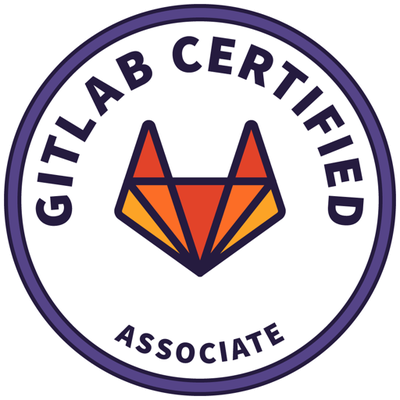

# About Me

I'm a Computer Engineer with more than 8 years of experience in IT, a lover of web development who decided to venture into the world of containers, automation, and everything related to the DevOps culture, with which I currently work. I have a master's degree in Mechanical Engineering in the field of Environmental Acoustics, from the Department of Mechanical Engineering of the Polytechnic School of the University of Sao Paulo.

I'm a person who is moved by challenges and new knowledge, Cuban who currently lives in Sao Paulo, Brazil. In my free time, I like to share good moments with my family/friends, ride a bike and play sports.

 

  
  

### Technologies & Tools

  
  
  
  
  
  
  

 

### Badges

  
  
  
  
  

---

  
  
  
  

